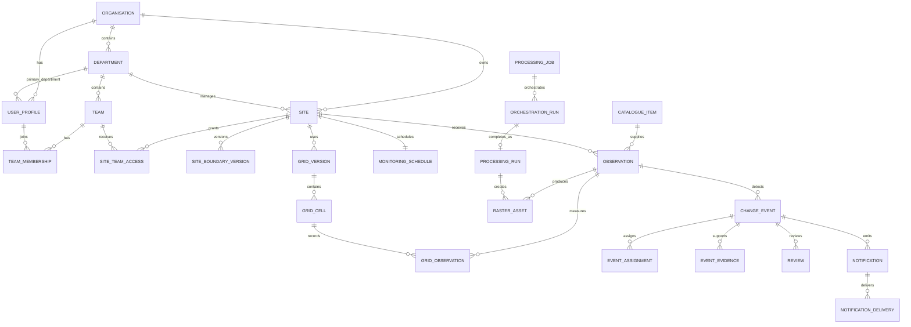

# Conceptual data model and state machines

Status: Phase 3 implemented. This document defines ownership, relationships,
access boundaries, and lifecycles; the physical SQL, indexes, constraints, and
RLS policies are implemented by the API Alembic migrations.

## Design rules

- The initial deployment has one organisation, but every tenant-owned record is
  organisation-scoped so isolated organisations can be added from the default
  workspace template later.
- A user belongs to exactly one organisation and one department.
- A user may belong to multiple teams inside that department.
- An organisation owns each site; one department manages it; multiple teams may
  be granted access.
- Organisation administrators always have access to their organisation's sites.
- A normal site is visible to organisation analysts. A sensitive site is visible
  only to administrators and explicitly granted teams.
- Verification officers see only referrals assigned to them.
- Tenant-owned foreign keys must not connect records from different
  organisations.
- All timestamps are stored in UTC and displayed in the user's chosen timezone.
- Operational and analyst state transitions produce immutable audit events.
- Geometries retain source, licence, attribution, version, and validation
  metadata; approximate webpage-derived boundaries are prohibited.
- Detection output represents an observable signal, never intent or wrongdoing.

## Ownership hierarchy

```text
Organisation
├── Departments
│   ├── Teams
│   │   └── Team memberships
│   └── Users (one primary department each)
├── Sites (one managing department each)
│   ├── Granted teams
│   ├── Boundary versions
│   ├── Grid versions and cells
│   └── Monitoring schedule
└── Organisation-scoped operational records
```

## Core entities

### Identity and access

#### `organisations`

An isolated customer workspace. Stores name, status, workspace-template version,
default timezone, and creation metadata.

#### `departments`

An organisational unit belonging to one organisation. Department names are
customer-configurable; the product does not assume a government structure.

#### `teams`

A working group belonging to one department. A team cannot contain users from a
different department or organisation.

#### `user_profiles`

Application profile associated with one authentication identity, one
organisation, and one primary department. Stores the confirmed application role:
administrator, analyst, authorised verification officer, or executive viewer.
Platform operators use a separate operational identity boundary.

#### `auth_credentials`

One local credential record per interactive user. Stores versioned Argon2id
password hash, password-change time, failed-attempt controls, and credential
status. It never stores plaintext or recoverable passwords.

#### `auth_sessions`

Revocable browser/device sessions. Stores only hashed rotating refresh-token
material, token-family identifier, creation/expiry/revocation data, safe device
metadata, and last activity. Access tokens are not persisted.

#### `password_reset_tokens`

Single-use, expiring, hashed reset tokens with request, consumption, and
invalidation metadata. Successful reset revokes applicable sessions.

#### `team_memberships`

Many-to-many membership between users and teams inside the user's department.
Includes membership status and audit metadata.

#### `invitations`

Single-use, expiring invitations for one organisation, department, and role.
Verification officers enter through this mechanism; there are no guest links.
Invitation secrets are single-use, expiring, and stored only as hashes.

#### `workspace_templates`

Versioned defaults used when provisioning a future organisation. Defines roles,
workflow configuration, notification defaults, and seed-site availability, but
never copies users or operational records between organisations.

### Sites and spatial structure

#### `sites`

An organisation-owned monitored area. Stores display metadata, managing
department, predefined/custom origin, sensitivity mode, lifecycle status,
monitoring health, and current boundary/grid references.

#### `site_team_access`

Explicit grants from a site to teams. Grants are required for sensitive sites;
for normal sites they may document operational responsibility without reducing
organisation-wide analyst visibility.

#### `site_boundary_versions`

Immutable versions of a site's polygon or multipolygon. Stores geometry, source
authority, source URL/identifier, licence, attribution, effective date,
coordinate reference system, validation result, checksum, and supersession.

#### `grid_versions`

Immutable definitions of how a boundary is divided for analysis. Stores grid
method, resolution, parameters, creation reason, and processing compatibility.

#### `grid_cells`

Cells belonging to one grid version. Stores stable cell key, geometry, area, and
optional display label. Observations reference a grid version so historical
results remain reproducible after a grid changes.

#### `monitoring_schedules`

One current schedule per site with weekly, fortnightly, or monthly cadence,
sensor/quality settings, next due time, last discovery cursor, active/suspended
status, suspension reason, and scheduling version.

### Catalogue, observations, and rasters

#### `catalogue_items`

Deduplicated references to upstream STAC/source items. Stores provider,
collection, source identifier, acquisition time, footprint, assets, licence,
attribution, and source metadata without copying source TIFFs.

#### `observations`

The suitability and processing relationship between a site and catalogue item.
Stores coverage, quality assessment, eligibility decision, grid version,
baseline relationship, discovery method, and lifecycle status.

#### `raster_assets`

Source-reference or derived raster metadata. Derived records store object key,
COG validation, spatial bounds, bands, resolution, checksum, size, processing
version, retention deadline, lineage, and supersession. TIFF bytes are never
stored in PostgreSQL.

#### `grid_observations`

Per-cell statistics for one processed observation and grid version. Stores
quality, available measurements, change features, and links to the exact
processing run and assets that produced them.

### Processing and workers

#### `processing_jobs`

The logical idempotent request to discover or process a site/observation. Stores
job type, trigger type, priority, idempotency key, requested configuration,
requesting actor, status, progress, cancellation data, and retry policy.

#### `orchestration_runs`

An immutable Airflow DAG-run projection associated with a product job. Stores an
opaque orchestrator run identifier, DAG/version, trigger time, current stage,
last callback, output summary, and structured terminal result. Technical task
retries remain in Airflow; retrying the whole product job creates another
orchestration run rather than overwriting history.

#### `processing_runs`

The reproducibility record for completed analytical execution. Stores input
assets, boundary/grid version, parameters, code/model version, environment,
timestamps, output assets, metrics, warnings, and checksums.

### Events and human review

#### `change_events`

An observable signal requiring review. Stores site, originating observation/run,
category, geometry, affected area/cells, signal strength, review status,
sensitivity, current assignment, and resolution. Category does not imply cause.

#### `event_grid_cells`

Many-to-many relationship between an event and affected grid cells, with the
cell-specific measurements that support the event.

#### `event_assignments`

Assignment history for analyst or authorised verification work. Stores assignee,
assigner, assignment type, due time, accepted/completed times, and status.

#### `event_evidence`

Evidence metadata associated with an event: raster comparison, analyst note,
authorised report, or institutionally obtained media. Stores source, collector,
time, access classification, checksum/object reference, and provenance. Evidence
storage inherits event and site permissions.

#### `reviews`

Immutable submitted analyst or verification decisions. Stores review type,
decision, rationale, confidence statement, actor, supporting evidence, and
submission time. Corrections create a superseding review.

#### `event_comments`

Discussion records for authorised collaborators. Comments are auditable and do
not replace formal reviews or state-transition reasons.

### Communication and governance

#### `subscriptions`

User preferences for site/event notifications, digest participation, and
permitted channels.

#### `notifications`

An in-app notification produced from a domain event. Stores recipient, safe
summary, sensitivity, read state, and link to the protected record. Sensitive
coordinates are excluded from notification content.

#### `notification_deliveries`

Per-channel delivery attempt for a notification. Stores destination reference,
provider identifier, attempt count, status, timestamps, and safe error metadata.

#### `audit_events`

Append-only record of authentication-relevant, administrative, data-access,
analyst, verification, job-control, export, and exceptional support actions.
Stores actor, organisation, action, target, before/after summary where safe,
reason, correlation ID, and timestamp.

#### `retention_holds`

Organisation-authorised holds that prevent scheduled deletion of referenced
assets or records. Holds require a reason, authority, scope, expiry/review date,
and audit trail.

#### `exports`

Audited asynchronous requests for GeoJSON, CSV, report, catalogue, or authorised
raster output. Stores requester, scope, filters, status, expiry, result object,
checksum, sensitivity, and download count. An export cannot widen the requester's
normal access.

#### `api_keys`

Hashed credentials belonging to one organisation and accountable user. Stores
name, approved scopes, creation/expiry/revocation data, last use, and safe usage
metadata. Raw secrets are shown once and never stored.

## Relationship summary



## State machines

### User account

```text
invited -> active -> suspended -> active
                    \-> disabled
invited -> expired
```

Suspension revokes active sessions. Organisation and department binding are set
by the accepted invitation; users cannot switch organisations.

### Authentication session

```text
active -> refreshed -> active
active -> logged_out
active -> revoked
active -> expired
```

Refresh-token reuse revokes the token family and creates a security audit event.

### Monitoring schedule

```text
active -> suspended -> active
active/suspended -> archived
```

Only administrators suspend, resume, or archive. Suspension requires a reason,
does not cancel running jobs, and does not backfill missed observations when
resumed. A schedule change applies after running work and recalculates the next
run from the change time.

### Observation

```text
discovered -> evaluating -> eligible -> queued -> processing -> ready
                         \-> ineligible
queued/processing -> failed -> queued (explicit retry)
ready -> superseded
```

Eligibility records coverage and quality reasons. `superseded` preserves an
older result after approved reprocessing; it does not delete provenance.

### Processing job and orchestration runs

```text
queued -> orchestrating -> running -> publishing -> completed
   |            |           |            |
   +------------+-----------+------------+-> retry_wait -> queued
   +------------+-----------+------------+-> failed
   +------------+-----------+------------+-> cancelled
```

- FastAPI creates the authoritative job before triggering Airflow.
- Airflow task retries do not create duplicate product jobs.
- An orchestration callback is authenticated, idempotent, and rejected when it
  conflicts with a terminal product state.
- Cancellation is explicit and audited.
- A job is `completed` only after outputs and database metadata are committed.
- Idempotency is scoped to organisation, site, observation, job type, grid
  version, and processing version.

### Change event

```text
new -> under_remote_review
under_remote_review -> dismissed
under_remote_review -> awaiting_more_observations -> under_remote_review
under_remote_review -> remotely_corroborated -> referred_to_authority
referred_to_authority -> institutionally_verified
referred_to_authority -> inconclusive
referred_to_authority -> dismissed
dismissed/institutionally_verified/inconclusive -> resolved
```

Automated actors may create `new` events but cannot remotely corroborate,
institutionally verify, dismiss, or resolve them.

### Review

```text
draft -> submitted -> superseded
draft -> discarded
```

Submitted reviews are immutable. A correction is a new review that explicitly
supersedes the earlier one. Analyst and institutional verification reviews use
distinct review types and permissions.

### Assignment

```text
pending -> accepted -> completed
pending/accepted -> declined
pending/accepted -> cancelled
```

Verification assignments expose protected case details only to the assigned
verification officer, administrators, and explicitly authorised oversight.

### Notification and delivery

```text
notification: unread -> read
delivery: pending -> sending -> delivered
                           \-> retry_wait -> sending
                           \-> permanently_failed
                           \-> suppressed
```

Email is suppressed when content cannot be safely represented without sensitive
location details. The protected in-app record remains available.

## Access matrix

| Capability | Administrator | Analyst | Verification officer | Executive viewer | Platform operator |
|---|---:|---:|---:|---:|---:|
| Manage organisation/users | Yes | No | No | No | No |
| Manage departments/teams | Yes | No | No | No | No |
| Create sites/schedules | Yes | No | No | No | No |
| View normal sites | Yes | Yes | Assigned referrals only | Approved summaries | No routine access |
| View sensitive sites | Yes | Granted teams only | Assigned referrals only | Approved summaries only | No routine access |
| Run remote review | No | Yes | No | No | No |
| Submit institutional verification | No | No | Assigned referrals only | No | No |
| View approved/resolved summaries | Yes | Yes | Assigned referrals | Yes | No routine access |
| Suspend/cancel monitoring work | Yes | No | No | No | Operational emergency only, audited |

## Retention mapping

- `catalogue_items`: reference retained with dependent provenance; source TIFF is
  not copied.
- `raster_assets`: two years by default, extended while linked to unresolved
  events or an active hold.
- `change_events`, `reviews`, evidence metadata, and `processing_runs`: seven
  years.
- `audit_events`: immutable for seven years.
- `notification_deliveries`: one year.
- Deleted sites: 30-day recovery window, followed by permitted deletion and a
  minimal audit tombstone.

## Phase 3 physical-design requirements

- Use database-enforced tenant consistency, not application checks alone.
- Apply row-level security to all organisation-owned tables.
- Add spatial indexes to current boundary, cell, observation-footprint, and event
  geometries.
- Add uniqueness constraints for source-item deduplication, job idempotency,
  active schedule per site, and current boundary/grid versions.
- Isolate Airflow's metadata database and credentials from the product database;
  DAG tasks update product state only through authenticated FastAPI operations.
- Partition or archive high-volume grid observations and audit events when
  measured volume justifies it.
- Test every role against normal sites, sensitive sites, assigned referrals,
  cross-team access, and cross-tenant denial.
